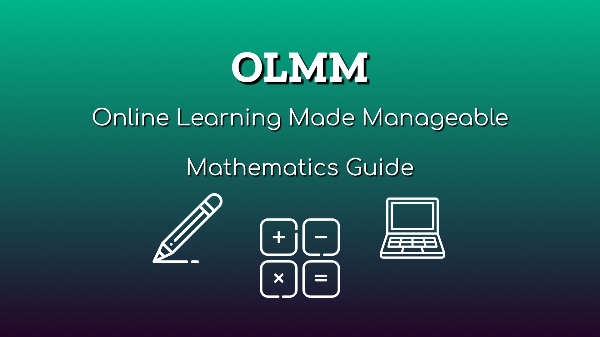

# OLMM - Mathematic Concept, Career, and Resource Guide
A sequential learning guide, topic outline for career fields, and resource reference for mathematics.

## Overview
* Guide Summary
* Subjects
    * Arithmetic
    * Algebra
    * Geometry 
    * Trigonometry
    * Calculus
    * Statistics & Probability
* Career Exploration
* References
* Licensing

## Guide Summary
This guide is an ever-growing resource for those wishing to learn new concepts, develop their pre-existing knowledge, and better understand how what subjects are necessary to pursue different career fields. 

This README file acts as the central hub that will provide access to more comprehensive pages related to individual subjects and career exploration. Within the reference section of this page, there will be general learning resources while individual pages will offer more specified information. 

My goal with Online Learning Made Manageable is to provide access to knowledge through resources available online including videos, books, online courses, blogs, and more. This specific guide centers on mathematics, but I hope to expand it to other subjects such as science, language arts, history, etc. To keep track of the future plans for this guide and any other future guides check out the [OLMM Trello Board](https://trello.com/invite/b/PzpnWFuP/ATTI13a13b80f7dd0fcbc5161814766a7e8266211E25/olmm).

## Subjects
### Arithmetic
**Arithmetic** is a foundational field of study for all mathematic pathways and provides basic to advanced operations for manipulating numbers. The concepts covered in this field of study are typically taught and mastered between grades K-8 and cover some of the following concepts:
* Counting
* Natural Numbers
* Addition, Subtraction, Multiplication, Division
* Integers or Whole Numbers
* Rational Numbers (Fractions and Decimals)

### Algebra
**Algebra** is where letters and other symbols (or variables) are introduced to represent numbers and act as placeholders in various equations. 

#### Pre-Algebra
Proceeding arithmetic one may take a **pre-algebra** (or *elementary algebra*) course to prepare for the concepts covered in algebra which is commonly taught in 7th to 8th grade and covers some of the following concepts:
* Order of Operation
* Equations
* Standard 4-Quadrant Cartesian Coordinate Plane
* Scientific Notation
* Pythagorean Theorem

#### Algebra 1
Further study of algebra at the secondary school level may then be broken down into two distinct courses. The first is Algebra 1 which is commonly taught in 9th grade and touches on:
* Solving Equations and Inequalities
* Slope
* X-Intercepts and Y-Intercepts
* Functions
* Quadratics

#### Algebra 2
Following an understanding of Algebra 1 students are typically given the option to pursue The next Algebra-oriented course would be Algebra 2 which is commonly taught in 11th grade and covers:  
* Polynomials
* Complex Numbers
* Exponential Models
* Logarithms
* Manipulating Formulas

### Geometry
**Geometry** is a mathematics branch that focuses on properties related to space such as distance, position, shapes, and sizes. This is commonly taught in 10th grade and covers:
* Transformations
* Congruence
* Shapes (Triangles and Circles)
* Angles and Arcs
* Volume

### Trigonometry
**Trigonometry** centers on triangles, particularly the relationship between their sides and angles. This is commonly taught in 10th or 11th grade, however, a student should be familiar with algebra and geometry beforehand and this covers:
* Sine, Cosine and Tangent
* Trigonometric Ratios and Values
* Right Triangles
* Radians
* Sinusoidal Functions, Equations, and Models 

### Calculus
**Calculus** is a mathematical branch that centers on the rates of continuous change and motion. It’s broken down into two divisions of calculus: differential and integral. 

#### Pre-Calculus
Before jumping into calculus, similarly to pre-algebra, **pre-calculus** is a course students can take that reviews concepts from algebra, geometry, and trigonometry to better prepare for calculus. This course is commonly taught in 11th grade or 12th grade and covers:
* Composite and Inverse Functions
* Complex Numbers
* Vectors
* Matrices
* Geometric Series

#### Differential Calculus
**Differential calculus** is typically taught before integral calculus and centers on the rate or sensitivity at which quantities change. This course is typically taught between the final year of secondary school (12th grade) and the sophomore year of college and covers:
* Derivatives
* Limits
* Motion
* L’Hôpital’s Rule
* Parametric Equations

#### Integral Calculus
**Integral calculus** is all about working with infinities or continuous sums. This course may also be taught between the final year of secondary school (12th grade) and the sophomore year of college as long as the student is familiar with differential calculus concepts and covers: 
* Definite Integrals
* Riemann Sums
* Differential Equations
* Arc Length
* Infinite Series

#### Multivariable Calculus
**Multivariable calculus** acts as a combination of both differential and integral calculus with some advancements and as the name implies, it deals with multiple variables rather than single variables. This level of calculus is rarely taught in secondary school with most concepts being thoroughly explored between the freshman to junior year of college, and covers:
* Derivative Types
* Integral Types
* Vector Field
* Line and Surface Integrals
* Gradient, Green, Stokes’, and Divergence Theorem

### Statistics & Probability
Statistics and probability are two closely intertwined concepts and act as an alternate path rather than pursuing pre-calculus. **Probability** focuses on chance, randomness, and the likelihood that something will happen. While **statistics** focuses on collecting, describing, analyzing, explaining, and presenting data. 

While basic concepts pertaining to statistics and probability are covered as early as a pre-algebra course more advanced subject matter is typically taught between the final year of secondary school (12th grade) and the sophomore year of college and covers:
* Categorical and Quantitative Data
* Data Collection
* Theoretical and Experimental Probability
* Random Variables
* Sampling Distributions

## Career Exploration
### Architecture
*Coming soon.*

### Computer Science
*Coming soon.*

### Data Analytics
*Coming soon.*

### Finance
*Coming soon.*

## References
### Videos
* [The Map of Mathematics](https://www.youtube.com/watch?v=OmJ-4B-mS-Y&t=164s)

## Licensing
 This work is licensed under a <a rel="license" href="http://creativecommons.org/licenses/by-nc-sa/4.0/">Creative Commons Attribution-NonCommercial-ShareAlike 4.0 International License</a>.